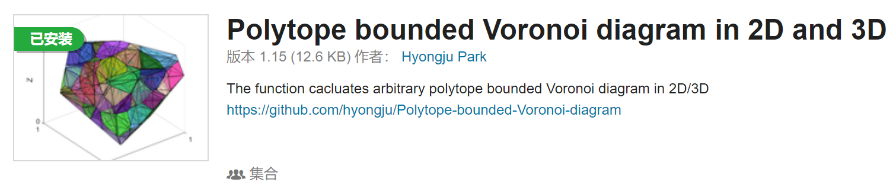
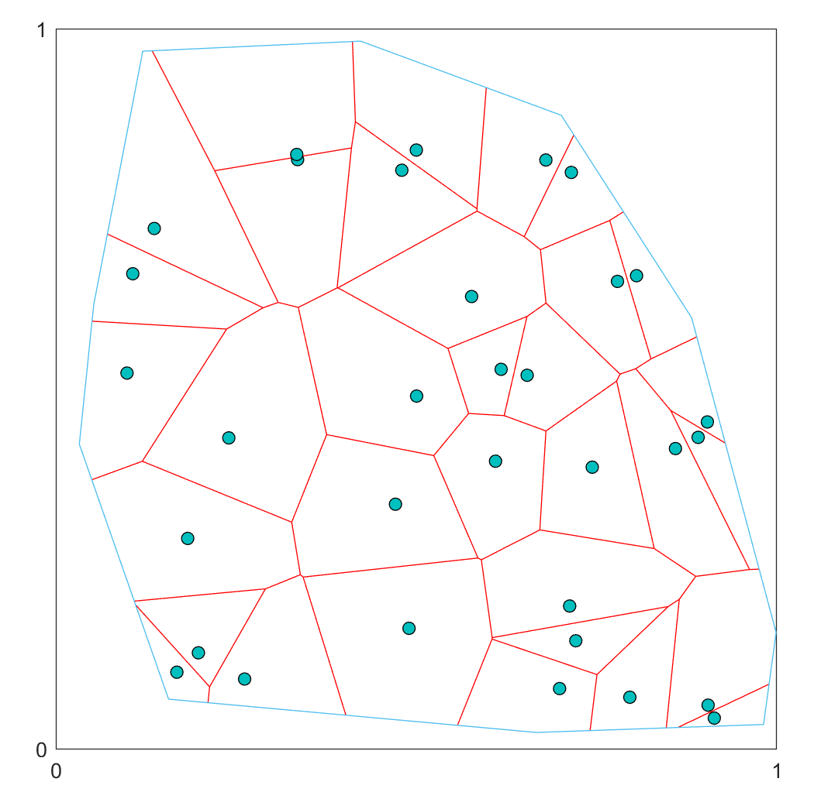
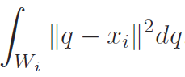
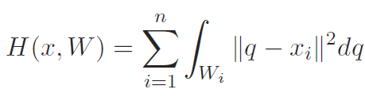
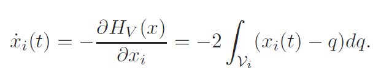
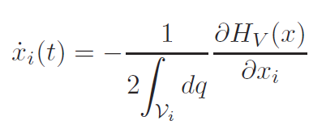
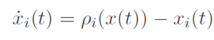
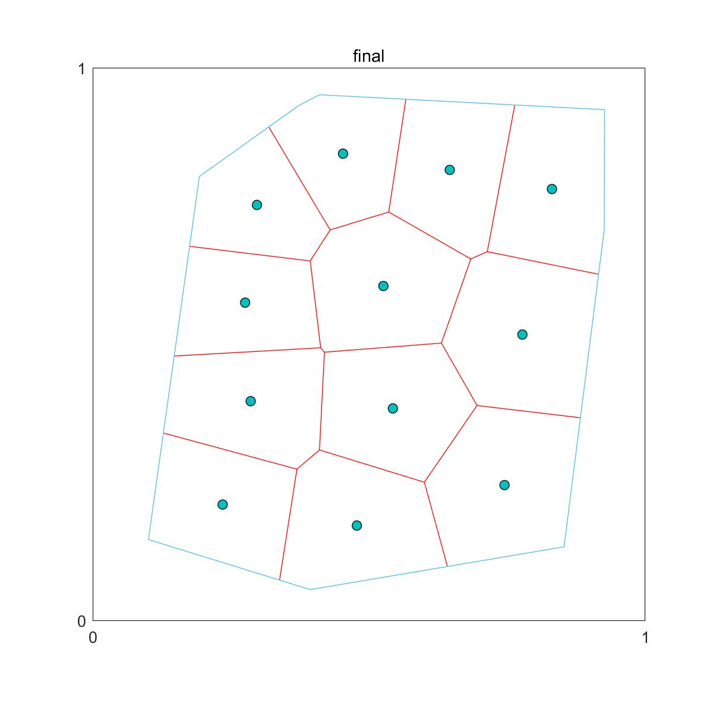
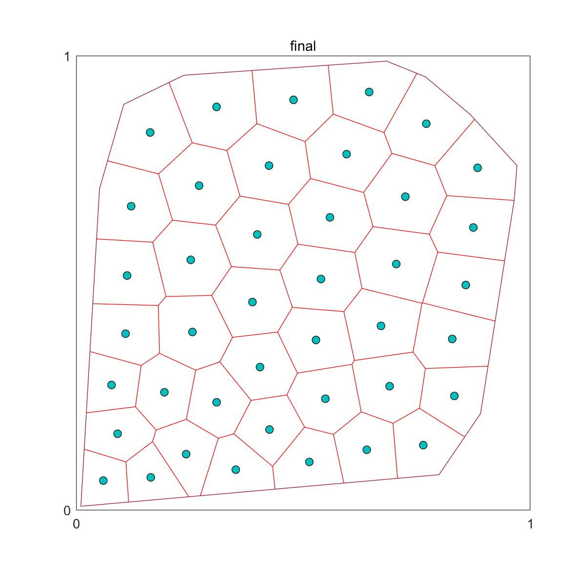
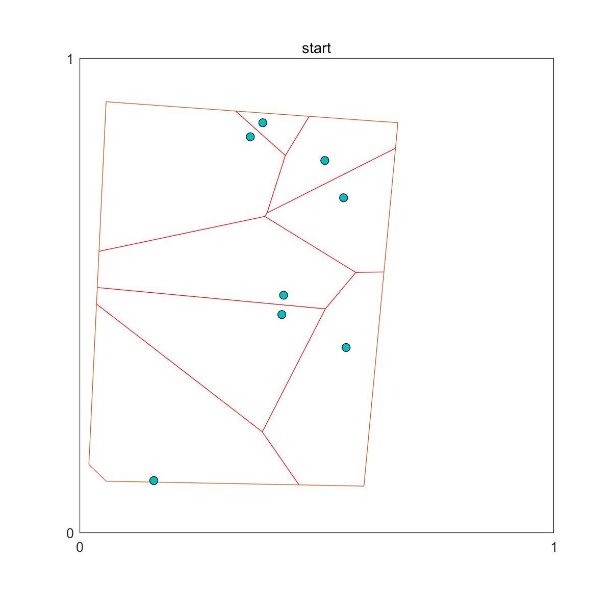

# **readme**

**Voronoi-based Coverage Algorithms**

问题描述：

对于给定的封闭的凸多边形，在凸多边形内随机生成若干点。

1. 基于给定点，实现对凸多边形的Voronoi划分。
2. 设计控制算法，使随机生成的点，能够移动到最优Voronoi划分的位置上。

**voronoi coverage**文件夹中的m文件实现了上述两个功能。

## 对凸多边形的Voronoi划分

参考了Matlab中的一个工具包：

**Polytope bounded Voronoi diagram in 2D and 3D**

给定凸多边形，给定多边形内的点，能够对多边形进行Voronoi划分。

执行**generator.m**

效果如图：

浅蓝色的线代表所指定的多边形bound

绿色的点代表在多边形内部随机生成的点

红色的线代表生成的voronoi划分

采用的算法：

**The Voronoi diagram is obtained using linear ineqaulities formed with perpendicular bisecters between any two connected points in the Deluanay triangulation.**

## **控制算法实现最优划分**

根据***Graph Theoretic Methods in Multiagent Networks***

定义每个区域的势能为：

凸多边形上的总势能为：

目标：使整个多边形上的能量最低。

力是势能的负梯度，受此启发，定义虚拟力：

根据每个区域的面积来调整虚拟力的大小，进一步得到：

对此控制算法进行仿真，本质上是求解常微分方程的初值问题。

常微分方程的求解使用四阶龙格-库塔算法，见**RK4.m**

**voronoi coverage**文件夹中共有3个demo文件，均可执行。

**demo1.m**

初始状态：

最终状态：

可见这些点的空间分布显著均匀，控制器效果很好。

**demo2.m**

初始状态：

点的数量很多，且空间分布很不均匀

最终状态：

空间分布显著改善。

值得指出的是，点的数目很多的情况下，求解速度会显著变慢。

执行demo2所需的时间较长。

**demo3.m**

起始状态：

最终状态：

此外，实现了**动画演示功能**。

函数为**animate.m**

demo3中调用了该函数，在执行时会动态画出点的运动过程。

三种情况下的gif图片也保存在voronoi coverage文件夹下。

**animation1.gif**

**animation2.gif**

**animation3.gif**

